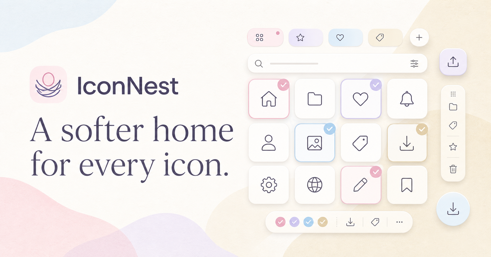

# IconNest

> 你的图标，都有归处。

IconNest 是一个现代化、本地优先的图标综合管理工作台。它把自己的 SVG、常用开源图标库、收藏、集合、搜索、复制与导出放进同一个清爽的网页界面中，并可通过 Docker 部署到 Ubuntu / Debian VPS。

> [!NOTE]
> 项目仍处于 `0.1.0 Preview` 打磨阶段，暂未发布正式 Release。数据结构与界面仍可能调整。



## 0.1.0 功能

- **私人图标库**：上传并安全清理 SVG，数据保存在浏览器本地
- **多来源探索**：通过 Iconify API 搜索 Lucide、Tabler、Phosphor、Remix Icon 与 Solar
- **集合与标签**：自定义集合、修改图标名称、添加或移除标签
- **收藏与最近浏览**：快速回到常用或刚刚查看过的图标
- **批量管理**：多选、批量收藏、移动集合、导出与删除
- **筛选与排序**：按来源筛选，并按时间、名称或来源排序
- **多种交付方式**：复制 SVG、HTML、React 组件或 CSS Mask，下载 SVG
- **灵活预览**：实时调色、缩放、旋转与水平翻转
- **剪贴板导入**：直接粘贴 SVG，并自动检测重复内容
- **备份与恢复**：将完整图标库导出为 JSON，并在其他设备恢复
- **回收站**：软删除、恢复或永久移除图标
- **主题与响应式布局**：支持浅色 / 深色模式、桌面端与移动端
- **本地优先**：0.1.0 不需要账号、数据库或云存储
- **Docker 部署**：提供 Dockerfile 与 Docker Compose 配置

## 技术栈

- React 19 + TypeScript
- Next.js App Router
- vinext + Vite
- Tailwind CSS 4
- Lucide React
- Iconify Search / SVG API
- Cloudflare Worker 兼容构建

## 快速开始

需要 Node.js `>= 22.13.0`。

```bash
git clone https://github.com/Elainaicey/IconNest.git
cd IconNest
npm install
npm run dev
```

打开终端显示的本地地址即可使用。

常用命令：

```bash
npm run dev      # 启动开发服务器
npm run build    # 生成生产构建
npm run start    # 预览生产构建
npm run lint     # 代码检查
npm test         # 构建并验证服务端输出
```

## Docker Compose 一键部署

默认配置直接从 GitHub Container Registry 拉取预构建镜像，不需要在 VPS 上编译源码。

```bash
mkdir -p iconnest && cd iconnest
curl -fsSLO https://raw.githubusercontent.com/Elainaicey/IconNest/main/docker-compose.yml
docker compose pull
docker compose up -d
```

默认访问地址为 `http://服务器IP:3000`。

如需修改端口：

```bash
ICONNEST_PORT=8080 docker compose up -d
```

更新到最新镜像：

```bash
docker compose pull
docker compose up -d
```

默认镜像：`ghcr.io/elainaicey/iconnest:latest`

生产环境建议在容器前配置 Caddy、Nginx 或 Traefik，并启用 HTTPS。镜像以非 root 用户运行，包含健康检查，并通过 GitHub Actions 自动构建 `linux/amd64` 与 `linux/arm64` 版本。

### 从源码构建

开发者需要本地构建时：

```bash
git clone https://github.com/Elainaicey/IconNest.git
cd IconNest
docker compose \
  -f docker-compose.yml \
  -f docker-compose.build.yml \
  up -d --build
```

## 数据与隐私

IconNest 0.1.0 使用浏览器 `localStorage` 保存图标、集合和偏好：

- 数据不会自动上传到 IconNest 服务器
- 删除浏览器站点数据会同时删除本地图标库
- 更换设备或浏览器前，请先使用侧边栏的“导出”功能备份
- SVG 上传大小上限为 256 KB；脚本、内嵌页面与危险事件属性会被移除
- 探索页会直接请求 Iconify 公共 API，请遵守各图标库自己的许可证

## 项目结构

```text
IconNest/
├─ app/
│  ├─ globals.css       # 设计系统、响应式布局与主题
│  ├─ layout.tsx        # 元数据与社交分享配置
│  └─ page.tsx          # 图标管理应用与交互逻辑
├─ public/
│  └─ og.png            # 社交分享封面
├─ tests/
│  └─ rendered-html.test.mjs
├─ worker/              # Cloudflare Worker 入口
├─ .openai/             # Sites 部署声明
├─ .github/workflows/   # 自动构建并发布 GHCR 镜像
├─ Dockerfile
├─ docker-compose.yml
├─ docker-compose.build.yml
├─ vite.config.ts
└─ package.json
```

## 版本路线

### 0.1.0 Preview

- 继续打磨交互、视觉与可访问性
- 完成预构建镜像发布流程
- 补充更多自动化测试后再创建正式 Release

### 0.2

- 可选 SQLite / PostgreSQL 服务端存储
- 多设备同步与账号系统
- SVG 批量上传与高级元数据编辑
- PNG / WebP 多尺寸导出

### 0.3

- 团队共享空间与权限
- Figma 插件 / 浏览器扩展
- 自定义 Iconify Provider
- 图标去重、相似度搜索与版本历史

## 图标来源

探索功能基于 [Iconify API](https://iconify.design/docs/api/)。Iconify 为不同开源图标集提供统一的搜索与 SVG 获取接口。IconNest 不重新授权第三方图标；使用、分发或商用前请查看具体图标集的许可证。

## 参与贡献

欢迎提交 Issue 与 Pull Request。建议在提交前运行：

```bash
npm run lint
npm test
```

## License

[MIT](./LICENSE)
